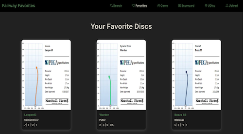
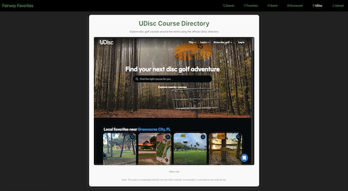
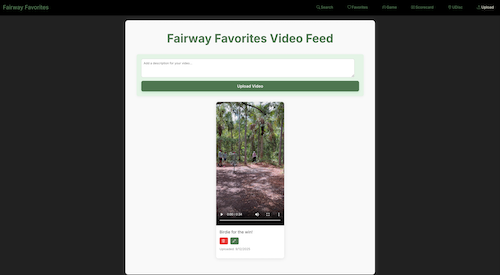

# Fairway Favorites

[Deployed application link](fairway-favorites.netlify.app) 

## Description

Fairway Favorites: Your ultimate React app for disc golf fanatics, packed with features you'll love!

The Home page allows a user to search for their favorite disc golf disc and save it to a favorites collection page. The application uses a real-world API to fetch for disc information and displays the name of the disc, category (ex. putter or driver) and flight information. The search page also includes "filter by flight" to search discs by speed, glide, turn and fade.  

The Game page features a hangman game for the user to guess the hidden disc name by typing one letter at a time until the user has guessed the correct word (with an alert congratulating the win) or when the whole hangman has been displayed (with an alert notifying the loss). Win or lose, you can continue playing as the word is ranomized and different each time. 

The Scorecard page allows a user to input player scores during their disc golf round. The scorecard defaults to two players, 18 holes and a par of 3 for each hole, but these can be updated. You can add or remove players and the number of holes being played and adjust the par settings per the course's layout. While inputting the scores for each player during a round, a leaderboard reflects the ranking and color corrdinates if a player is under-par (green), even-par (orange) or over-par (red). The scorecard is saved to localstorage for future reveiw and can be cleared to its default setting.

The UDisc page displays an iframe for a user to explore disc golf courses from around the world using the official UDisc directory. Functionality and layout is controlled by the external site. If a user's browser does not support iframes, a link to visit the website is displayed and will redirect the user to explore. 

The Upload page allows a user to upload videos of their favorite disc golf shots. The user can add a description of the video prior to uploading. If one is not entered, the default description will display "No description provided". After the video is posted, the description can be edited and saved. Videos are saved to localForage and has the option to be deleted. 

## Table of Contents 

- [Built With](#built-with)
- [Installation](#installation)
- [Usage](#usage)
- [Contribute](#how-to-contribute)
- [Questions/Contact](#questions)
- [License](#license)

## Built With

 

## Installation

1. Clone project repository down into your desired directory
2. Open project terminal and run the command `npm install` to install the packages and dependencies
3. To invoke the application run the command `npm run dev`, and open https://localhost:5173/ to view in the browser 
4. To end the application from running, run the command `control c`

## Usage

**For lovers of the game** 🥏

The images show the web application's apperance

## How to Contribute

Contributions are what make the open source community such an amazing place to learn, inspire, and create. Any contributions you make are greatly appreciated and if you have any suggestions please let me know. 

Do not forget to give the project a **STAR**⭐. Thank you!

The Contributor Covenant guidelines are here for your review: [Contributor Covenant](https://www.contributor-covenant.org/).

## Questions

[Link to GitHub Profile](https://github.com/mandi7469)

If you have additional questions please email me at mandi7469@aol.com

## License

N/A